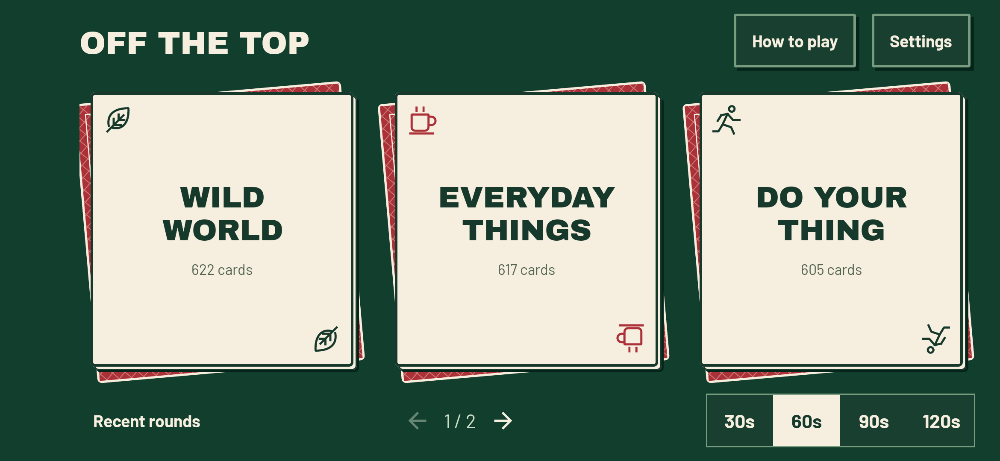
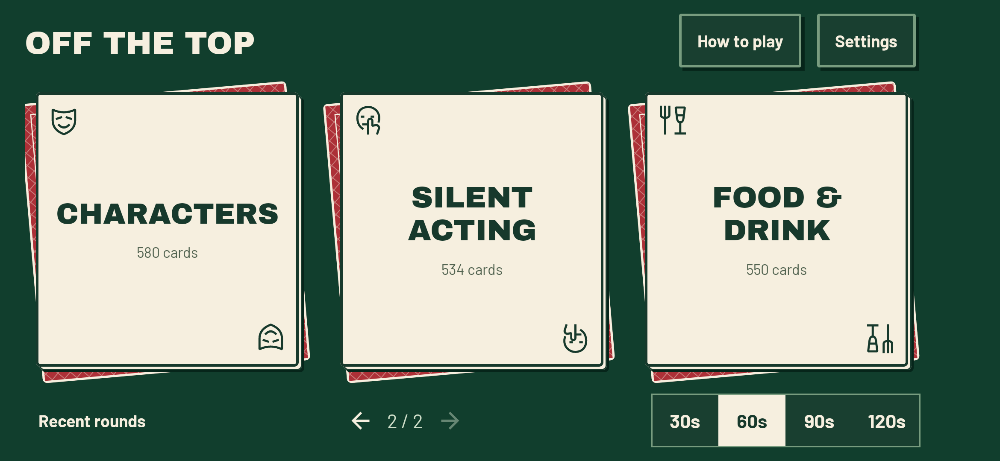
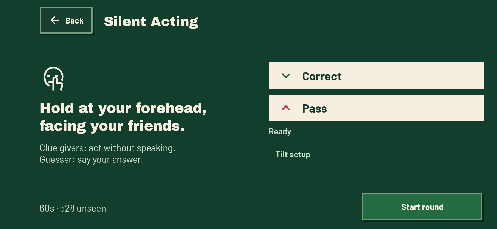
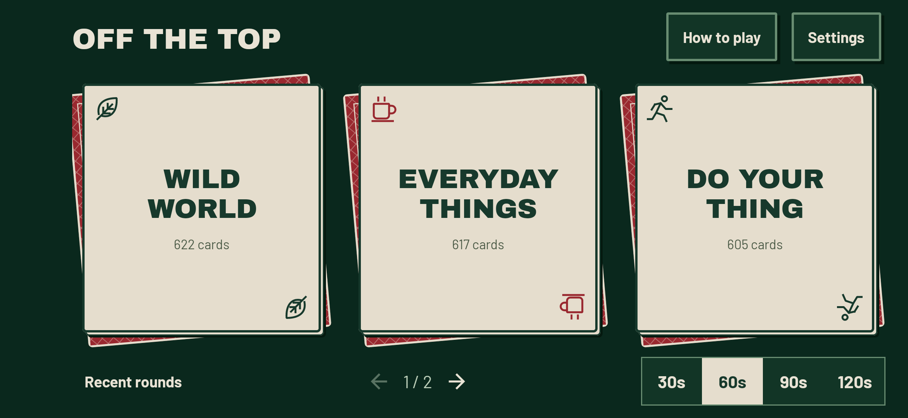
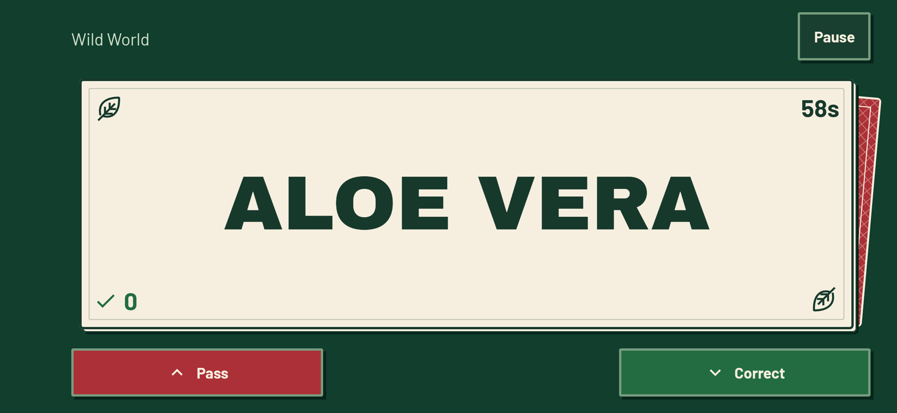
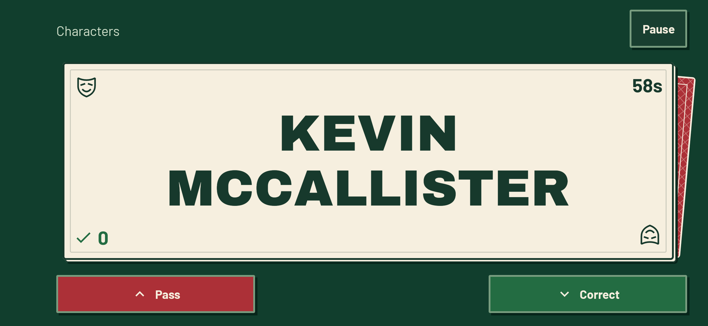
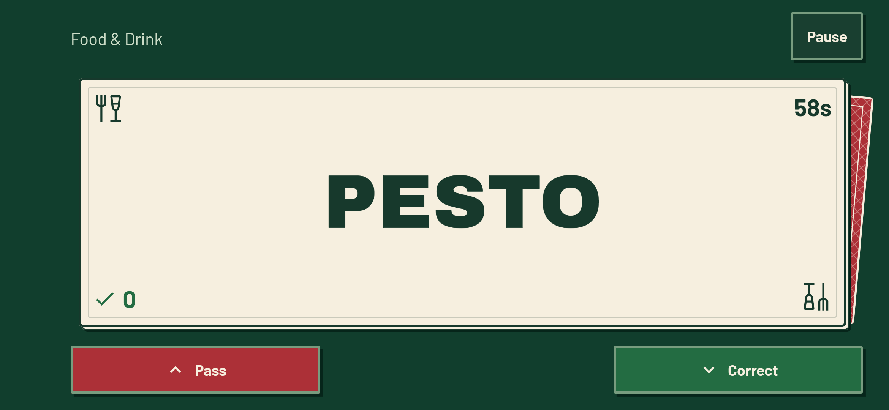
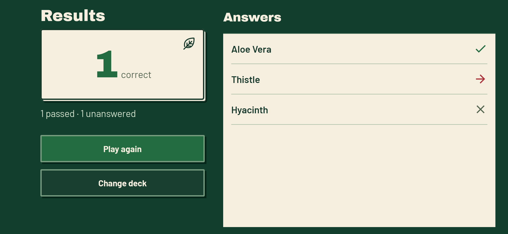

# Off the Top

An independently made, offline Android forehead-guessing party game. Six decks, no ads, no accounts, no network access. Not affiliated with Heads Up! or its publishers.

**Version 1.5.0** · Android 8.0+

[Release page](https://github.com/SeleniumEclipse/off-the-top/releases/tag/v1.5.0) · [Direct Android APK](https://github.com/SeleniumEclipse/off-the-top/releases/download/v1.5.0/Off-the-Top-1.5.0.apk)

Install the signed APK over the existing app without uninstalling to keep settings, round history and played-card memory.

## Six decks

| Deck | Cards | What's inside |
|---|---:|---|
| Wild World | 622 | Animals, plants, Earth, weather and space |
| Everyday Things | 617 | Objects, food, tools, clothing, instruments and transport |
| Do Your Thing | 605 | Activities, jobs, places, sports and situations |
| Characters | 580 | Fictional characters from games, animation, books, comics, films and TV |
| Silent Acting | 534 | Actions, jobs and situations to mime without spoken clues |
| Food & Drink | 550 | Ingredients, dishes, snacks and drinks |

**3,508 deck entries, representing 2,933 unique topic titles.** The original three decks and their 1,844 titles are unchanged. This update adds 1,089 new titles and deliberately reuses 575 existing prompts in the new themed decks; there are no duplicates within a deck. See [deck counts, reuse and content limits](DECKS.md).

Swipe between pages or use the arrows, labeled **Previous decks** and **Next decks** for screen readers. Roomy layouts show two pages of three cards; narrower layouts show three pages of two. Returning home remembers the page during the current app session.

Characters now includes familiar fictional pop culture, including names from mature works. Food & Drink includes alcoholic drinks. Familiarity varies by age, region and interests; these are not children-only decks. Pass anything the group does not know or wants to skip.

Day/night/system theme, motion practice, gentle tilts, touch-only option, sound, vibration, four round lengths, automatic pause and editable round review remain available.

## Play

Choose a deck and round length. Hold the phone sideways at your forehead with the screen facing your friends. **Hold still during the countdown so it learns your starting angle.** Friends describe or act out the card without saying its words. Nod the **screen down** for correct; **up** to pass. Return to your starting angle between cards. Small nods work: 28° normally, or 20° with Gentle tilts. Touch controls are always available. Practice shows a short readiness cue; open **Tilt setup** for the live angle and Reset tilt button. Pause and resume to relearn your hold during a round.

**Silent Acting:** clue givers mime silently; the guesser can speak. The app shows this rule before play but does not listen for or enforce silence, and requests no microphone permission. Mime dangerous situations rather than attempting them.

Pause stops the clock. Leaving the app automatically pauses a running round. Review and correct your answers afterward.

Played titles now share one memory across all decks and app restarts. Seeing an overlapping title in one deck also marks it seen in the others. Old per-deck memory is combined once on upgrade. When a selected deck has no unseen titles left, its titles become available again; unrelated played titles stay remembered. The reset option makes all titles available without clearing round history. See [how shared memory works](DECKS.md#how-repeats-are-avoided) for exact matching and reset behavior.

## Build

Native Kotlin / Jetpack Compose; Java 17+, Android SDK 35, min Android 8. Gradle wrapper included. Build with `gradlew.bat :app:assembleDebug`. Tests: `gradlew.bat :app:testDebugUnitTest :app:connectedDebugAndroidTest :app:lintRelease` (emulator required for connected tests).

When other emulators are connected, set `ANDROID_SERIAL` to this game's dedicated test device before running connected tests. The [signed-release check](tools/release-smoke.ps1) accepts `-Serial` as well; do not target another project's device.

For a signed release supply `-PsigningProperties=C:/private/keystore.properties` to `:app:assembleRelease`. The supplied properties file contains storeFile, storePassword, keyAlias, keyPassword. The keystore path is relative to that properties file. Signing material is deliberately excluded from source archives.

## Testing strategy

Native Android only; no web backend, authentication, browser or database service. Test the pure round/timer and tilt engine with JUnit. Test all bundled decks for count, format, within-deck duplicates and intentional overlap. Check shared played-card memory, upgrade migration and reset behavior. Run Android Compose tests for deck paging, compact and enlarged-text layouts, Silent Acting guidance, timed touch play, pause/resume, settings persistence, review corrections and replay. Install and launch the actual signed release on the Android emulator; inspect screenshots and crash logs. Test sensor values through emulator controls and deterministic gravity-vector tests. Real-hand comfort and actual speaker/vibration feel require a physical phone and are not implied by emulator tests.

## Theme and fonts

The approved **Card Table** theme: flat green background, cream playing-card faces, red printed backs and stacked edges. **No outer table outline.** Six original vector category marks identify the decks instead of card suits or emoji. Green means correct; red means pass. Both day and night retain readable cream cards, with darker felt and slightly dimmer stock at night. Set's Archivo Black/Barlow fonts and pressed-button style remain. No gradients, glows, betting or money mechanics. See [the design rules](DESIGN.md) and [the original three-deck design preview](design/card-table.html).

## Validation

**140 unit tests and 38 Android tests passed**, including shared-memory migration, all six deck flows, paging, original vector artwork, intact picker labels and 216 long-clue render cases. The signed APK was installed over the earlier app and checked through the emulator's real sensor stack, timer, new decks and saved history. The tilt engine is unchanged; deck selection and played-card memory have changed as described above. See [the validation report](VALIDATION.md) for recorded coverage and physical-device limits.

